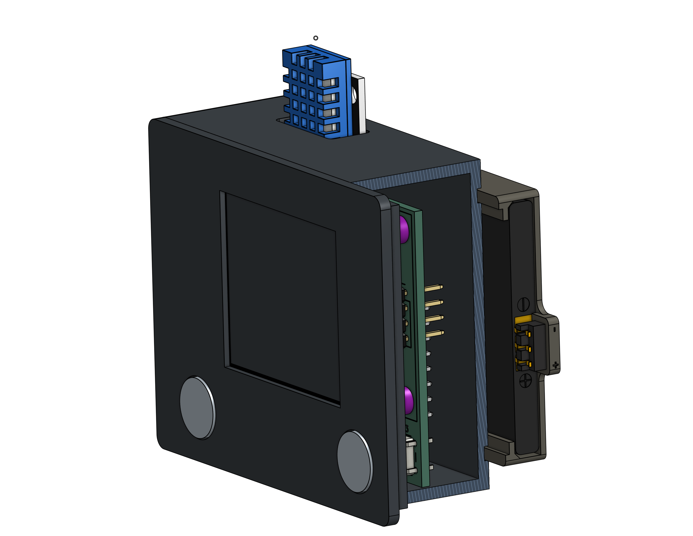
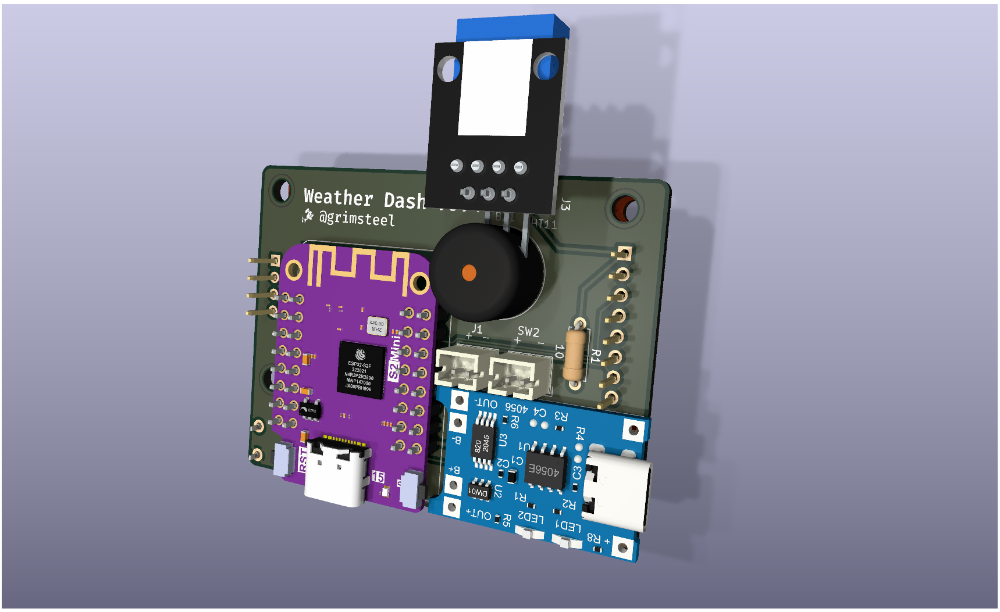

# Weather Dashboard

> LCD weather dash powered by an ESP32-S2 and a 1.8" TFT

## Case

[Onshape](https://cad.onshape.com/documents/d06c112e58f115f3ec29811b/w/2a8c46b6d89bea48d93f043a/e/2a97cfce612bd0256a92786b?renderMode=0&uiState=676c6f4b24d20336a44b9517)

**Switch to the "Demo" named view!**

## PCB

[Kicanvas](https://cad.onshape.com/documents/d06c112e58f115f3ec29811b/w/2a8c46b6d89bea48d93f043a/e/2a97cfce612bd0256a92786b?renderMode=0&uiState=676c6f4b24d20336a44b9517)

### Major Components:

- Wemos S2 Mini
- 1.8" TFT
- DHT11 temp/humidity sensor
- Li-ion battery charger

### Voltage Calculations:

1. ESP32-C3 requires 3.0-3.6V input voltage
2. The LDO technically requires 4.3V for a stable 3.3V, _but_ starts providing 3.0V at an input of ~3.1V
3. The battery is 3.8V
4. The 1N5817 Schottky has a voltage drop of 0.25V at 200 mA
5. Therefore, the LDO will be provided with 3.45V and will output 3.2-3.3V
